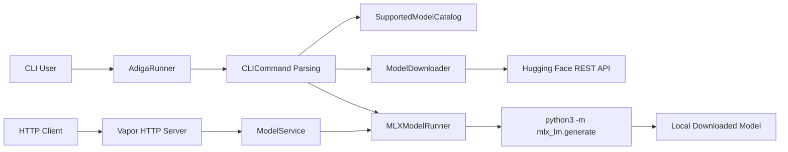
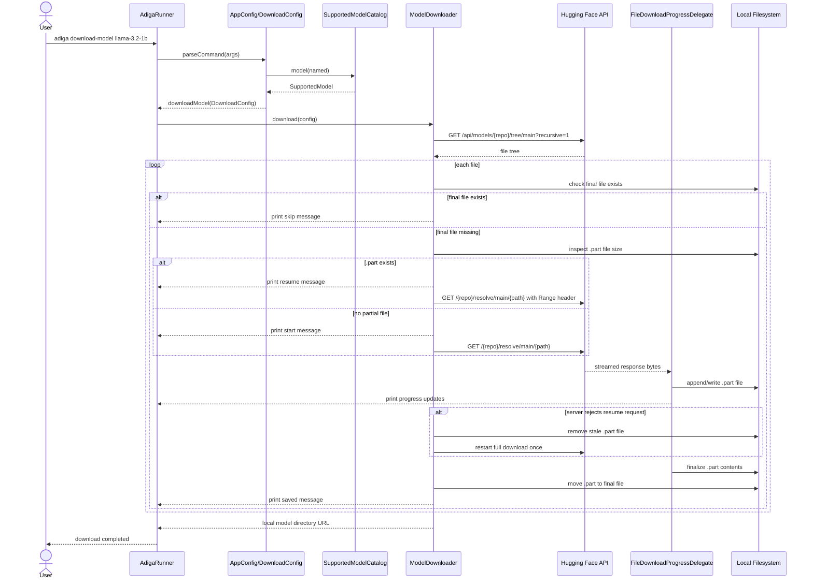
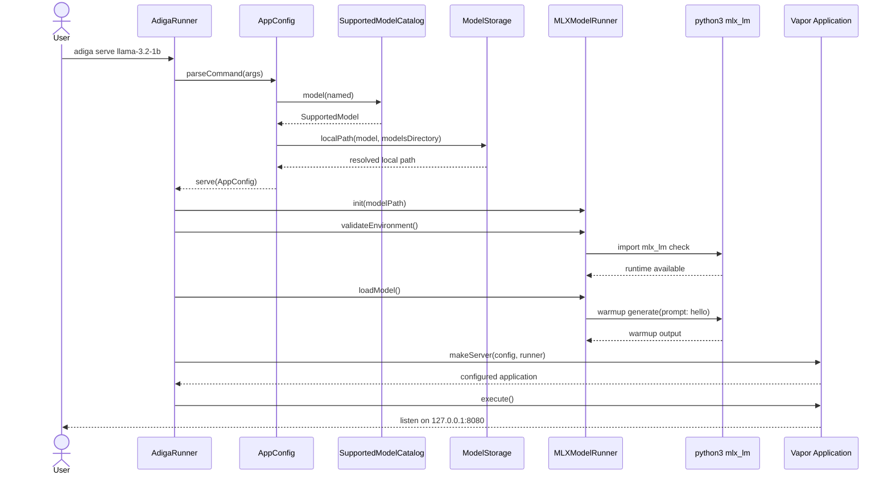
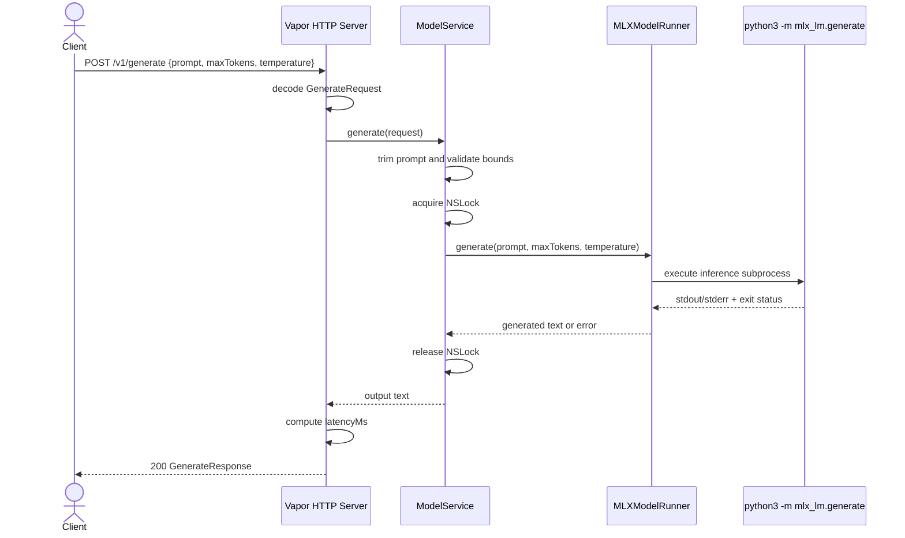
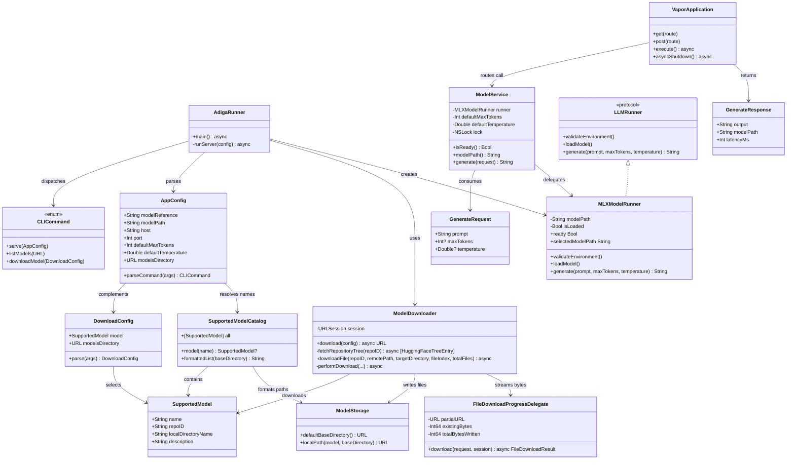

# AdigaRunner Design Document

## Overview

AdigaRunner is a local macOS command-line application written in Swift. It serves a local HTTP API for prompt-based LLM inference, supports a hard-coded catalog of approved models, can download those models into local storage, and can start the inference server using either a downloaded supported model name or a direct local model path.

The current implementation uses:

1. Swift for CLI parsing, model catalog handling, HTTP serving, local download management, progress reporting, and resumable downloads.
2. Native Swift HTTP APIs for model downloads from Hugging Face.
3. Python `mlx_lm` only for inference execution inside the current `MLXModelRunner` implementation.

## High Level Requirements

### Functional Requirements

1. The application must run as a local CLI program on macOS.
2. The application must expose a local HTTP REST API for LLM inference.
3. The CLI must support listing a hard-coded set of supported models.
4. The CLI must support downloading a selected supported model to local storage.
5. The CLI must support starting the inference server using either:
   - a supported model name that resolves to a downloaded local model directory, or
   - a direct local model path.
6. The server must accept prompts over HTTP and return generated text.
7. The server must expose health and readiness endpoints.
8. The server must support request-level generation options such as max tokens and temperature.
9. The application should support a streaming-oriented generation endpoint.
10. Model downloads should provide visible progress in the CLI.
11. Model downloads should resume from partially completed files when possible.

### Non-Functional Requirements

1. The application must run locally on macOS 13 or later.
2. The HTTP server must bind to a local host address by default.
3. Startup configuration must be validated early with clear CLI errors.
4. The design must keep the user-facing HTTP API stable even if the inference backend changes later.
5. The implementation should prefer simple operational behavior over maximum concurrency in the first version.
6. The downloader should tolerate interruptions and avoid restarting large model files unnecessarily.
7. The service should return deterministic error messages for invalid CLI usage, invalid HTTP requests, and runtime failures.

## How People Will Use This App

### Primary Users

1. Developers who need a localhost LLM endpoint for automation or app integration.
2. Engineers testing local inference workflows on macOS.
3. Users who want a controlled, supported list of models rather than arbitrary remote model selection.

### Typical Usage Flows

#### Flow 1: Discover supported models

```bash
swift run adiga list-models
```

This prints the hard-coded supported model names, descriptions, source repositories, and resolved local storage paths.

#### Flow 2: Download a supported model

```bash
swift run adiga download-model llama-3.2-1b
```

This downloads the model files from Hugging Face into the default local directory:

```text
~/.adigarunner/models
```

During download, the CLI prints:

1. The model being downloaded.
2. The target directory.
3. File-by-file progress.
4. Resume notices when `.part` files already exist.

#### Flow 3: Start the server with a supported model name

```bash
swift run adiga serve llama-3.2-1b
```

The CLI resolves `llama-3.2-1b` to its local downloaded directory and starts the HTTP server.

#### Flow 4: Start the server with a direct local model path

```bash
swift run adiga /path/to/local/model
```

This bypasses the supported model catalog and directly uses the supplied path.

#### Flow 5: Call the local HTTP inference endpoint

```bash
curl -X POST http://127.0.0.1:8080/v1/generate \
  -H 'Content-Type: application/json' \
  -d '{
    "prompt": "Explain local inference in one paragraph.",
    "maxTokens": 128,
    "temperature": 0.7
  }'
```

### CLI Commands

```text
adiga list-models [--models-dir <path>]
adiga download-model <model-name> [--models-dir <path>]
adiga serve <model-name|model-path> [--host 127.0.0.1] [--port 8080] [--max-tokens 256] [--temperature 0.7] [--models-dir <path>]
adiga <model-name|model-path> [--host 127.0.0.1] [--port 8080] [--max-tokens 256] [--temperature 0.7] [--models-dir <path>]
```

### Operational Behavior

1. The CLI parses the requested command.
2. `list-models` prints the hard-coded model catalog.
3. `download-model` downloads all model files into local storage.
4. Interrupted downloads leave `.part` files behind for later resume.
5. `serve` resolves a supported model name into a local directory or uses a direct path.
6. At server startup, the model runtime is validated and warmed.
7. The server then accepts prompt requests over HTTP.

## High Level Design

### Architectural Style

The application follows a layered local-service architecture with separate responsibilities for:

1. CLI command parsing and orchestration.
2. Supported-model discovery and resolution.
3. Native Swift download management.
4. HTTP serving and request handling.
5. Inference execution through the current MLX subprocess adapter.

### High Level Components

1. `AdigaRunner`
   - Entry point.
   - Dispatches between list, download, and serve commands.

2. `AppConfig` and `DownloadConfig`
   - Parse CLI arguments.
   - Validate flags and supported model names.
   - Resolve supported model names to local storage paths.

3. `SupportedModelCatalog`
   - Defines the hard-coded supported models.
   - Provides lookup and formatted listing.

4. `ModelStorage`
   - Defines the default local storage root.
   - Builds local filesystem paths for supported models.

5. `ModelDownloader`
   - Fetches repository file trees from Hugging Face.
   - Downloads model files using native Swift HTTP.
   - Reports file progress.
   - Supports resuming from `.part` files using HTTP range requests.

6. `HTTPServer`
   - Creates the Vapor application.
   - Registers health, readiness, generation, and streaming routes.

7. `ModelService`
   - Validates generation requests.
   - Applies default parameters.
   - Serializes inference execution.

8. `MLXModelRunner`
   - Validates the inference runtime.
   - Loads and warms the local model.
   - Executes `python3 -m mlx_lm.generate`.

### High Level Data Flows

#### Model Listing Flow

1. User runs `list-models`.
2. CLI loads the hard-coded catalog.
3. CLI prints supported models and their local storage targets.

#### Model Download Flow

1. User runs `download-model <name>`.
2. CLI validates the model name against the catalog.
3. `ModelDownloader` queries the Hugging Face repository tree.
4. `ModelDownloader` downloads each file into the local model directory.
5. If a `.part` file exists, the downloader resumes from the saved offset.
6. Completed partial files are promoted to final file names.

#### Inference Server Flow

1. User runs `serve <name|path>`.
2. CLI resolves supported model names into local paths.
3. `MLXModelRunner` validates local runtime dependencies.
4. The model is warmed with a minimal generation call.
5. The Vapor server starts on the configured host and port.
6. HTTP clients send prompts to `/v1/generate` or `/v1/generate/stream`.
7. `ModelService` validates request data and invokes `MLXModelRunner`.
8. The server returns generated text.

### High Level Diagram



## Low Level Design

### Module Responsibilities

#### AdigaRunner

- File: `Sources/AdigaRunner/AdigaRunner.swift`
- Responsibility: top-level CLI orchestration.
- Key behavior:
  - Parse the CLI command.
  - Route to model listing, model download, or server startup.
  - Print command results and error messages.

#### AppConfig

- File: `Sources/AdigaRunner/AppConfig.swift`
- Responsibility: parse and validate CLI arguments for server startup.
- Key fields:
  - `modelReference`
  - `modelPath`
  - `host`
  - `port`
  - `defaultMaxTokens`
  - `defaultTemperature`
  - `modelsDirectory`
- Behavior:
  - Supports explicit `serve` command and backward-compatible direct startup.
  - Resolves supported model names into local model directories.

#### DownloadConfig

- File: `Sources/AdigaRunner/AppConfig.swift`
- Responsibility: parse and validate the `download-model` command.
- Behavior:
  - Validates that the model name exists in the supported catalog.
  - Supports overriding the models directory.

#### SupportedModel and SupportedModelCatalog

- File: `Sources/AdigaRunner/SupportedModels.swift`
- Responsibility: define the supported model set.
- Each entry contains:
  - display name
  - source repository ID
  - local directory name
  - description

#### ModelStorage

- File: `Sources/AdigaRunner/SupportedModels.swift`
- Responsibility: determine where supported models are stored locally.
- Default path:

```text
~/.adigarunner/models
```

#### ModelDownloader

- File: `Sources/AdigaRunner/ModelDownloader.swift`
- Responsibility: native Swift model download implementation.
- Behavior:
  - Fetch the repository tree from Hugging Face.
  - Filter file entries.
  - Download each file into the local directory.
  - Skip files that already exist in final form.
  - Resume incomplete files from `.part` state using `Range` headers.
  - Restart cleanly from byte zero if the server refuses resume semantics.
  - Emit progress messages during download.

#### FileDownloadProgressDelegate

- File: `Sources/AdigaRunner/ModelDownloader.swift`
- Responsibility: stream file bytes from `URLSessionDataTask` into partial files while reporting progress.
- Behavior:
  - Open or append to `.part` files.
  - Track total bytes written.
  - Parse `Content-Range` to determine final expected size on resumed downloads.
  - Print progress in percentage steps or transferred MB when total size is unavailable.

#### HTTPServer

- File: `Sources/AdigaRunner/HTTPServer.swift`
- Responsibility: configure the Vapor application.
- Routes:
  - `GET /health`
  - `GET /ready`
  - `POST /v1/generate`
  - `POST /v1/generate/stream`

#### ModelService

- File: `Sources/AdigaRunner/ModelService.swift`
- Responsibility: bridge HTTP requests to inference execution.
- Behavior:
  - Trim and validate prompts.
  - Apply default generation settings.
  - Enforce token and temperature bounds.
  - Serialize inference calls with `NSLock`.

#### MLXModelRunner

- File: `Sources/AdigaRunner/MLXModelRunner.swift`
- Responsibility: interact with the current inference backend.
- Behavior:
  - Verify the local model path exists and is readable.
  - Verify Python and `mlx_lm` are available.
  - Warm the model.
  - Run inference through a child process.

### CLI Contracts

#### `list-models`

Purpose:
- Show the supported hard-coded model catalog.

Output includes:
1. model name
2. description
3. source repository ID
4. resolved local path

#### `download-model <model-name>`

Purpose:
- Download a supported model into the configured local directory.

Behavior:
1. Validate supported model name.
2. Discover remote files.
3. Download or resume each file.
4. Print progress.

Failure cases:
1. unsupported model name
2. repository not found
3. access denied
4. network failure
5. invalid HTTP response

#### `serve <model-name|model-path>`

Purpose:
- Start the HTTP inference server.

Behavior:
1. Resolve supported model names to local paths.
2. Fail if a supported model was not downloaded.
3. Accept direct paths without catalog lookup.

### HTTP Endpoint Contracts

#### GET /health

Response:

```json
{
  "status": "ok"
}
```

#### GET /ready

Response:

```json
{
  "ready": true,
  "modelPath": "/path/to/model"
}
```

#### POST /v1/generate

Request:

```json
{
  "prompt": "Explain MLX in one paragraph.",
  "maxTokens": 128,
  "temperature": 0.7
}
```

Response:

```json
{
  "output": "...generated text...",
  "modelPath": "/path/to/model",
  "latencyMs": 842
}
```

Validation rules:
1. `prompt` must not be empty after trimming.
2. `maxTokens` must be in 1...8192.
3. `temperature` must be in 0.0...2.0.

#### POST /v1/generate/stream

Current behavior:
1. Full generation is performed first.
2. Output is split on spaces.
3. The response is emitted as SSE-formatted token events plus a terminal `done` event.

### Download State Model

Each model file can exist in one of three states:

1. Missing
   - No local file exists.
   - Download starts from byte zero.

2. Partial
   - A `.part` file exists.
   - Download resumes from the current file size using an HTTP `Range` request.

3. Complete
   - Final file exists without `.part` suffix.
   - Downloader skips the file.

### Error Handling Design

#### CLI Errors

Examples:
1. Missing command.
2. Missing model path or supported model name.
3. Unsupported model name.
4. Supported model requested for serving but not downloaded yet.
5. Invalid flag value.

#### Download Errors

Examples:
1. Hugging Face repository not found.
2. Access denied for repository.
3. Network connectivity issues.
4. Invalid or incomplete HTTP responses.
5. File size mismatch after download completion.
6. Resume not honored by the server, forcing a one-time clean restart.

#### Runtime Errors

Examples:
1. Missing Python runtime.
2. Missing `mlx_lm` package.
3. Invalid local model path.
4. Inference subprocess failure.

### Concurrency Model

Inference remains serialized through `ModelService` using `NSLock`.

Download behavior is sequential per file in the current version.

Rationale:
1. Simpler correctness for large model downloads.
2. Easier progress reporting.
3. Lower risk of overwhelming local disk or network resources.

### Extension Points

The current design leaves several clear upgrade paths:

1. Replace `MLXModelRunner` subprocess inference with native Swift MLX bindings.
2. Add authenticated Hugging Face downloads for gated repositories.
3. Add concurrent download scheduling with bounded parallelism.
4. Add `--force-redownload` and stale `.part` cleanup commands.
5. Add a persistent default selected model.
6. Expose supported model metadata over HTTP.
7. Replace simulated SSE token splitting with true token streaming.

## Sequence Diagrams

### Supported Model Download



### Server Startup With Supported Model Name



### Synchronous Inference Request



## Class Diagram



## Current Design Tradeoffs

### Benefits

1. Clear supported-model UX with predictable names and locations.
2. Native Swift downloads without Python dependency for model fetching.
3. Download progress and resumability improve large-model usability.
4. HTTP API remains stable while inference backend can evolve independently.

### Limitations

1. Inference still depends on Python `mlx_lm` rather than native Swift MLX.
2. Downloads are sequential rather than parallel.
3. Gated or authenticated repositories are not yet handled.
4. Streaming generation is still simulated from a completed output string.
